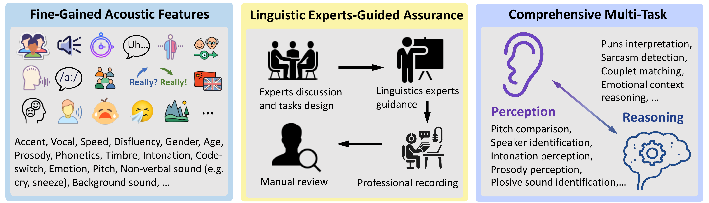
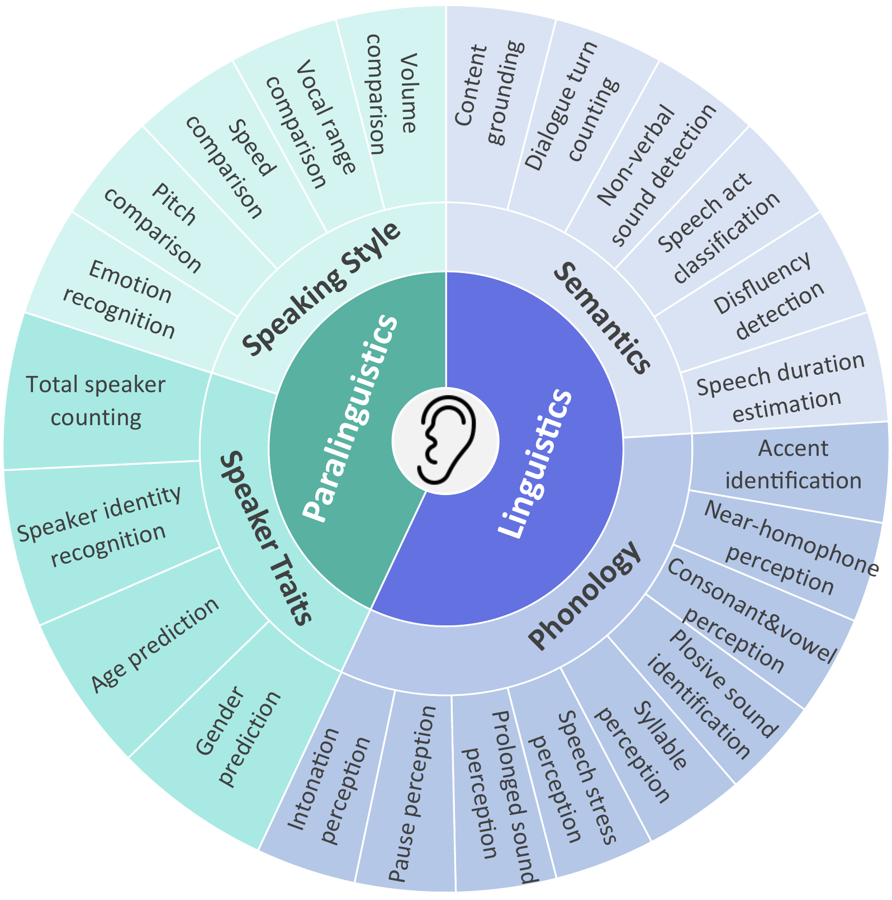

# MMSU: A Massive Multi-task Spoken Language Understanding and Reasoning Benchmark

[**MMSU Audio Download (HuggingFace)**](https://huggingface.co/datasets/ddwang2000/MMSU)



MMSU is a comprehensive benchmark designed specifically for understanding and reasoning in spoken language. MMSU comprises 5,000 meticulously curated audio-question-answer triplets across 47 distinct tasks. To ground our benchmark in linguistic theory, we systematically incorporate a wide range of linguistic phenomena, including phonetics, prosody, syntax, syntactics, semantics, and paralinguistics. MMSU aims to provide a structured and systematic approach to evaluate the capabilities of SpeechLLMs in understanding and reasoning across multiple facets of spoken language in practical contexts.

## Overview of MMSU Structure
MMSU consists of three levels of depth to classify different tasks and assessment dimensions. **At the first level**, MMSU distinguishes between two fundamental dimensions: perception abilities and reasoning abilities. Similar to human cognitive processes, perception focuses on extracting basic audio information and recognizing fundamental speech features, while reasoning involves deeper cognitive processes for interpretation and inference. **At the second level**, both dimensions are further divided into linguistics and paralinguistics categories. Linguistics is the scientific study of language structure, meaning, and usage, whereas paralinguistics is a component of meta-communication that studies the effect of vocal characteristics on semantic interpretation, such as emotion, pitch, and volume. **At the third level**, the linguistics category branches into semantics and phonology. Semantics focuses on the content-related aspects, including meaning interpretation and contextual understanding, while phonology deals with sound patterns such as tone, prosody, and phonemic distinctions. Concurrently, the paralinguistics category divides into speaker traits and speaking style. Speaker traits involve inherent characteristics such as voice timbre and speaker identity, while speaking style encompasses variable elements such as pitch, speed, and emotion.




## Download MMSU Data
Refer to Huggingface: https://huggingface.co/datasets/ddwang2000/MMSU

## Evaluation
Step1: Inference your model on MMSU Benchmark
```bash
python mmsu_inference.py --input_jsonl /path/to/input.jsonl --output_jsonl /path/to/output.jsonl
```

Step2: Evaluate on MMSU Benchmark
```bash
python mmsu_evaluation.py /path/to/your/input.jsonl
```

## Citation
```
@article{wang2025mmsu,
      title={MMSU: A Massive Multi-task Spoken Language Understanding and Reasoning Benchmark}, 
      author={Dingdong Wang and Jincenzi Wu and Junan Li and Dongchao Yang and Xueyuan Chen and Tianhua Zhang and Helen Meng},
      journal={arXiv preprint arXiv:2506.04779},
	    year={2025}
}
```
